<span class="bigTitle">JavaScript For Cats</span>
## An introduction for new programmers <span class="right"></span>
### *So easy your human companion could do it too!*

JavaScript is a programming language or, in other words, a means by which a computer is instructed to do things. Just the same as one controls humans with hisses and meows, one controls computers with statements written in a programming language. All web browsers understand JavaScript and you can take advantage of that to make web pages do crazy things!

JavaScript started as a way to make web pages more interactive. Nowadays JavaScript runs in more places than just web browsers &mdash; it runs on web servers, phones and even robots! This page will teach you some JavaScript basics so that you can get up and running in no time*.

\* *Actual time: more than none. Probably an hour or two. Also since you are a cat you are less likely to run and more likely to lay around in the sun*

JavaScript for Cats is [CC0 Licensed](https://creativecommons.org/publicdomain/zero/1.0/)

## Table of contents

- [The console](#basics)
- [Strings](#strings)
- [Values and variables](#values)
- [Using functions](#functions)
- [Built in JS functions](#standard-library)
- [Download new JS functions](#third-party-javascript)
- [Writing new functions](#writing-functions)
- [Loops](#loops)
- [Arrays](#arrays)
- [Objects](#objects)
- [Callbacks](#callbacks)
- [Recommended reading](#recommended-reading)

## Don't be a scaredy-cat

<span class="right">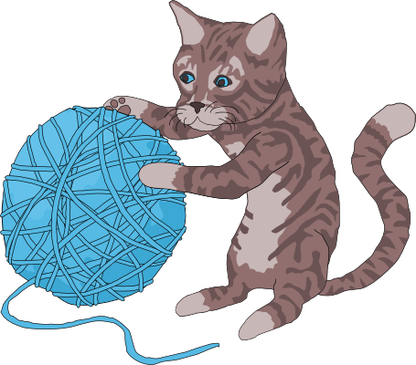</span>

You will always land on your feet &mdash; even when programming! Unlike [pawing over a glass of water](images/dealwithit.gif) on your laptop, _nothing_ in these tutorials will damage your computer in any way, even if you mistype a command or click the wrong button. Like cats, computer programmers make mistakes all time: misspelling things, forgetting quotes or brackets, and being forgetful of how basic functions (and yarn, lasers) work. Programmers care more about making it work _eventually_ rather than trying to make it work the very first time. The best way to learn is by making mistakes!

So don't be a scaredy-cat! The absolute worst thing that will happen is that you might have to refresh this page in your web browser if you get stuck. Don't worry though, this will happen very rarely.

## <a id="basics" href="#basics">#</a> The basics

There is JavaScript running on this page right now.  Let's play around with it a little. For the sake of simplicity I'll assume you are using Google Chrome to read this page (if you aren't it's probably easier on both of us if you follow along with Chrome).

First, right click anywhere on the screen and hit **Inspect Element**, then click on the **Console** tab. You should see a thingy that looks like this:

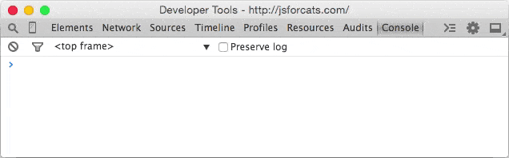

This is a console, otherwise known as a "command line" or "terminal". Basically it's a way to type one thing at a time into a computer and immediately get the computers answer back. They are super useful as a learning tool (I still use the console nearly every day that I'm coding).

The console does some pretty cool stuff. Here I have started to type something and the console is helping me out by giving me a list of all the possible things I could continue to type! Another thing you could do is type `1 + 1` into the console and then hit the `Enter` key and watch what happens.

Using the console is a very important part of learning JavaScript. If you don't know if something works or what the command is for something, go to the console and figure it out! Here's an example:

### <a id="strings" href="#strings">#</a> Strings

Since I am a cat I want to replace every instance of the word `dog` on the Internet with `those blasted dogs`. First go into your console and type in a few sentences that contain the word `dog` at least once. In JavaScript a bunch of letters, numbers, words or anything else is known as a **String** (as in a *string* of characters). Strings have to begin AND end with a quotation mark. Single `'` or double `"` is fine, just make sure you use the same at the beginning as you do at the end.

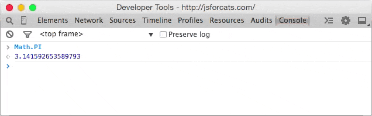

See the nasty error message? Don't worry - you didn't break any laws. SyntaxError ILLEGAL is just the way it sounds when robots tell you that your program has a problem. The first two sentences had matching quotation marks at the beginning and end, but when I mixed single and double quotation marks it freaked out on me.

OK, to fix up one of these sentences (by replacing `dog` with our enhanced version) we have to first save the original sentence so that we can call it up later when we do our replacing magic. Notice how the string gets repeated in red when we type it into the console? This is because we haven't told it to save the sentence anywhere so it just gives it right back (or it gives us an Error back if we messed something up).

### <a id="values" href="#values">#</a> Values and variables

**Values** are the simplest components in JavaScript. `1` is a value, `true` is a value, `"hello"` is a value, `function() {}` is a value, the list goes on! There are a handful of different **types** of values in JavaScript but we don't need to go over them all right away &mdash; you will learn them naturally the more you code!

To store values we use things called **variables**. The word 'variable' means 'can change' and is used because variables can store many different types of values and can change their value many times. They are pretty much like mailboxes. We put something in a variable, like our sentence, and then give the variable an address that we can use to look up the sentence later. In real life mailboxes have to have PO Box numbers but in JavaScript you usually just use lowercase letters or numbers without any spaces.

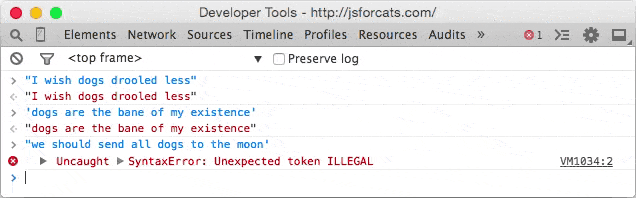

`var` is shorthand for variable and the `=` means *store the thing on the right-hand side in the thing on the left-hand side*. Also as you can see, now that we are storing our sentence in a variable the console doesn't just return our sentence right away, but instead gives us `undefined` which means *there was nothing to return*.

If you simply type a variable name into the console it will print out the value stored in that variable. A note about variables is that by default they go away when you switch to a different page. If I were to hit the Refresh button in Chrome, for example, my `dogSentence` variable would get wiped and it would be like it never existed. But don't worry about this too much for now &mdash; you can just hit the up or down arrows on your keyboard while in the console to go through everything you've entered in recently.

### <a id="functions" href="#functions">#</a> Functions

Now that we have our sentence stored in a variable, let's change a word stored in it!  We can do this by performing a *function*.  *Functions* are a type of value that, well, serve a specific *function* (AKA purpose or action) for us. Calling them "actions" sounded weird I guess so they went with the word "function" instead.

JavaScript has a function called `replace` that does exactly what we want! Functions take in any number of values in their parentheses (zero, one or many) and return either nothing (`undefined`) or the changed string. The `replace` function is available to use on any strings and takes in two values: the characters to take out and the characters to swap in. It gets confusing to describe these things so here is a visual example:

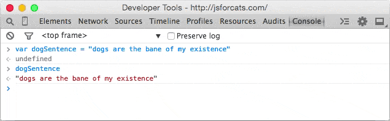

Notice how the value of `dogSentence` is the same even after we run `replace` on it? This is because the `replace` function, (and most JavaScript functions for that matter) takes the value we give it and returns a **new value**, without modifying the value we passed in. Since we didn't store the result (there is no `=` on the left side of the replace function) it just printed out the return value in our console.

### <a id="standard-library" href="#standard-library">#</a> The "standard library"

You might be wondering what other functions are available in JavaScript. The answer: A TON. There are lots **built in, standard libraries** that you can learn about at MDN (A site run by Mozilla that has lotsa nifty information about web technologies). For example [here is the MDN page on JavaScript's Math object](https://developer.mozilla.org/en-US/docs/JavaScript/Reference/Global_Objects/Math).

### <a id="third-party-javascript" href="#third-party-javascript">#</a> Third-party JavaScript

There is also a lot of JavaScript code available that is **not built in**. JavaScript from third parties is usually referred to as a "library" or "plugin". One of my favorites is called **Underscore.js**. Let's go and grab it and load it into our page! First go to the Underscore site, [http://underscorejs.org/](http://underscorejs.org/), click on the download link (I usually use development versions because they are easier to read but both will give you the same basic functionality), and then copy all the code onto your clipboard (you can use Select All from the Edit menu to select everything). Then paste it into your console and hit enter. Now your browser has a new variable in it: `_`. Underscore gives you a ton of helpful functions to play with. We'll learn more about how to use them later.

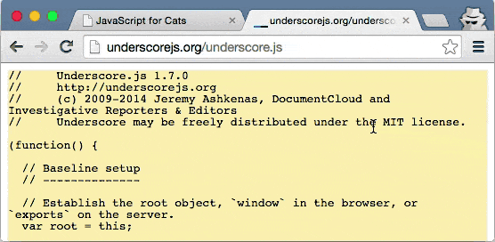

### <a id="writing-functions" href="#writing-functions">#</a> Making new functions

You aren't limited to using other peoples functions &mdash; you can also write them yourself. It's pretty easy! Let's make a function called `makeMoreExciting` that adds a bunch of exclamation points to the end of a string.

    function makeMoreExciting(string) {
      return string + '!!!!'
    }

In my head I read it out loud like this: "there's a function called 'make more exciting' that takes in a string and returns a new copy of that string that has a bunch of exclamation points at the end". Here is how we would write this in the console manually if we weren't using a function:


The expression `string + '!!!!'` returns a new string and our variable called `string` stays the same as before (since we never updated it to anything else with `=`).

Let's use our function instead of doing it manually. First, paste the function into the console and then **call** the function by **passing in** a string:

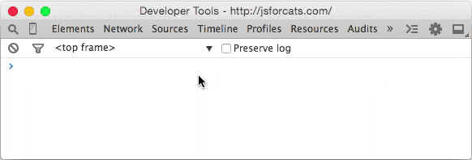

You could also call the same function by passing in a variable that points to a string (in the above example we just typed the string straight in there as a value instead of saving it to a variable first):

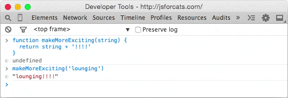

The line `makeMoreExciting(sentence)` is equivalent to saying `sentence + '!!!!'`. What if we wanted to **modify in-place** (aka update) the value of sentence? Simply save the return value of the function back into our `sentence` variable:

    var sentence = "time for a nap"
    sentence = makeMoreExciting(sentence)

Now `sentence` will have the exclamation marks in it! Note that you only have to use `var` when you are **initializing** a variable &mdash; the first time you ever use it. After that you shouldn't use `var` unless you want to re-initialize (reset/clear/empty) the variable.

What would happen if we took out the `return` statement in our function?


Why is `sentence` empty? Because functions return `undefined` by default! You can choose to return a value by `return`ing something. Functions should take in a value and, if they change the value or create a new value that is supposed to be used later, `return` a value (fun fact: a fancy term for this style is *functional programming*). Here is another function that doesn't return anything but instead uses a different method to show us the output:

```js
function yellIt(string) {
  string = string.toUpperCase()
  string = makeMoreExciting(string)
  console.log(string)
}
```

This function, `yellIt`, uses our previous function `makeMoreExciting` as well as the built-in String method [toUpperCase](https://developer.mozilla.org/en-US/docs/JavaScript/Reference/Global_Objects/String/toUpperCase). Methods are just a name for a function when it belongs to something &mdash; in this case `toUpperCase` is a function that belongs to `String` so we can refer to it as either a method *or* a function. `makeMoreExciting` on the other hand doesn't belong to anyone so it would be technically incorrect to refer to it as a method (confusing, I know).

The last line of the function is another built-in that simply takes in any values that you give it and prints them out into the console.

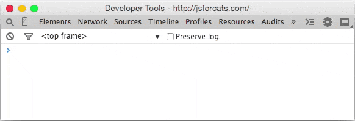

So is there something wrong with the above `yellIt` function? It depends! Here are the two major types of functions:

  - functions that modify or create values and return them
  - functions take in values and perform some action that cannot be returned

`console.log` is an example of the second type of function: it prints things out to your console &mdash; an action that you can see with your eyes but that cannot be represented as a JavaScript value. My own rule of thumb is to try to keep the two types of functions separate from each other, so here's how I would rewrite the `yellIt` function:

```js
function yellIt(string) {
  string = string.toUpperCase()
  return makeMoreExciting(string)
}

console.log(yellIt("i fear no human"))
```

This way `yellIt` becomes more **generic**, meaning it only does one or two simple little things and doesn't know anything about printing itself to a console &mdash; that part can always be programmed later, outside the function definition.

### <a id="loops" href="#loops">#</a> Loops

Now that we have some basic skills under our belt (*Author's note: do cats even wear belts?*) we can start being lazy. What?! Yes, that's right: programming is about being lazy. Larry Wall, inventor of the Perl programming language, called laziness the [most important virtue](http://c2.com/cgi/wiki?LazinessImpatienceHubris) of a good programmer. If computers didn't exist you would have to do all sorts of tedious tasks by hand, but if you learn to program you can lay in the sun all day while a computer somewhere runs your programs for you. It is a glorious lifestyle filled with relaxation!

Loops are one of the most important ways to harness the power of a computer. Remember `Underscore.js` from earlier? Make sure you have it loaded in the page (remember: you can just hit the up arrow on your keyboard a few times and then hit `Enter` to load it in again if you need to) and try copy/pasting this into your console:
  
```js
function logANumber(someNumber) {
  console.log(someNumber)
}
_.times(10, logANumber)
```

This code uses the [times](http://underscorejs.org/#times) method of Underscore which takes in 1 number and 1 function and then starts from 0 and for 10 steps counts up by 1, calling the function with the number each step of the way.

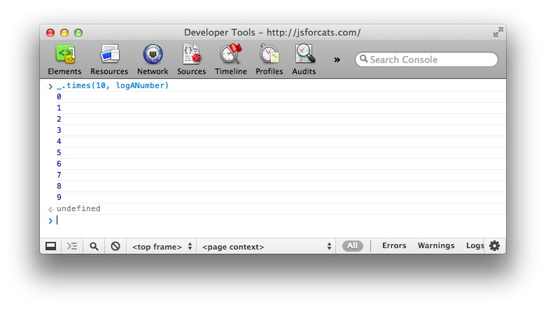

If we were to manually write out what `times` is doing in the above code it would look like this:

```js
logANumber(0)
logANumber(1)
logANumber(2)
logANumber(3)
logANumber(4)
logANumber(5)
logANumber(6)
logANumber(7)
logANumber(8)
logANumber(9)
```

But cats refuse to do unnecessary manual work like this so we must always ask ourselves, *"am I doing this in the laziest way possible?"*.

So why is this called looping? Think of it like this: If we were to write out a list of 10 numbers (from 0 to 9) using a JavaScript Array it would look like this:

```js
var zeroThroughTen = [0, 1, 2, 3, 4, 5, 6, 7, 8, 9]
```

What `times` really does is visit each number and repeat a task: in the example above the task was to call the `logANumber` function with the current number. Repeating tasks in this way is referred to as *looping over* the Array.

### <a id="arrays" href="#arrays">#</a> Arrays

I've mentioned these a few times but let's spend a minute learning about them. Imagine you need to keep track of all your buddies. Well, an Array will do just fine. Think of an Array like a sorted list that you can keep *tons* of stuff in.

This is how you make one:

```js
var myCatFriends = ["bill", "tabby", "ceiling"]
```

Sweet! Now you have a list of your cat buddies.

Elements (that is what you call a single item in an array) that are stored within arrays start at 0 and count up from there. So `myCatFriends[0]` returns `bill` and `myCatFriends[1]` returns `tabby`... etc etc.

To get buddies out of your brand new Array you can just access an element directly like so: 

```js
console.log(myCatFriends[0])
```

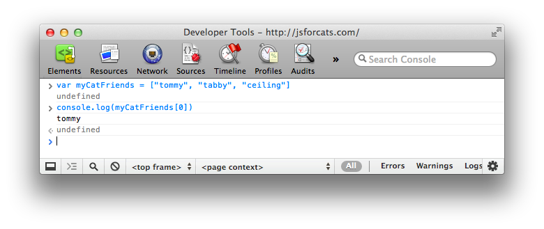

If you made a brand new cat friend at the hippest cat club the other night and you want to add them to your list it is super simple: `myCatFriends.push("super hip cat")`.

To check that the new cat made it into your array you can use `.length`:

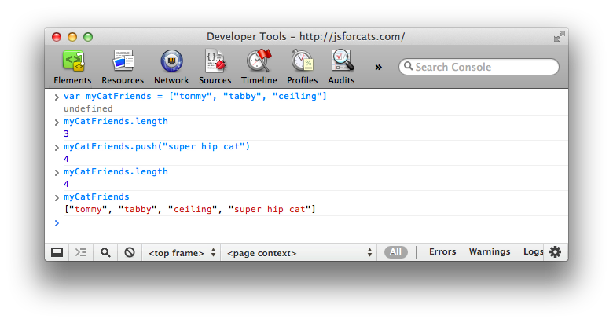

Notice how `push` returned the length? Handy! Also take note that arrays will always **preserve ordering** which means they will remember the order in which you added or defined things. Not everything in JavaScript preserves ordering so remember this special property of Arrays!
  
### <a id="objects" href="#objects">#</a> Objects

Arrays are good for lists, but for other tasks they can be hard to work with. Consider our array of cat friends. What if you also wanted to store more than just names?

```js
var myCatFriends = ["bill", "tabby", "ceiling"]
var lastNames = ["the cat", "cat", "cat"]
var addresses = ["The Alley", "Grandmas House", "Attic"]
```

Sometimes it is nice to have all of the addresses or names in one variable. But sometimes you have a cat in mind, let's say Bill, and you just want to look up that cat's address. With arrays it takes a lot of work because you can't just say 'hey array, give me Bill's address' because 'Bill' is in one array and his address is in a totally different array.

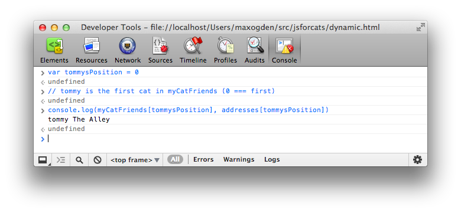

This can be brittle because if our arrays change and we add a new cat to the beginning we would have to also update our `billsPosition` variable to point to the new location of Bill's information in the arrays! Here is a easier to maintain way to store information like this using objects:

```js
var firstCat = { name: "bill", lastName: "the cat", address: "The Alley" }
var secondCat = { name: "tabby", lastName: "cat", address: "Grandmas House" }
var thirdCat = { name: "ceiling", lastName: "cat", address: "Attic" }
```
  
Why would we do it this way? Because now we have a variable for each cat that we can use to get that cats values in a more convenient and readable way. 

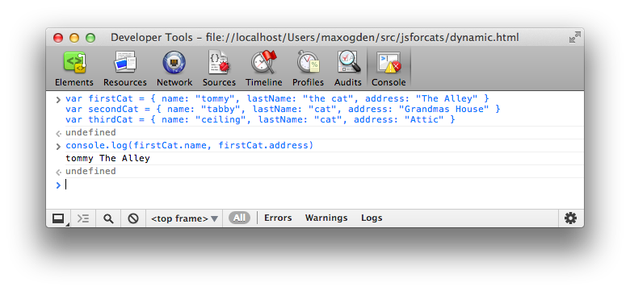

You can think of Objects like keys on a keyring. Each one is for a specific door and if you have nice labels on your keys you can open doors very fast. In fact, the things on the left hand side of the `:` are called **keys** (are also known as **properties**) and the things on the right hand side are **values**.

```js
// an object with a single key 'name' and single value 'bill'
{ name: 'bill' }
```

So why would you ever use arrays if you can just put your data in objects? Because objects don't remember the order of the keys that you set. You might enter in an object like this:

```js
{ date: "10/20/2012", diary: "slept a bit today", name: "Charles" }
```

But the computer could give it back to you like this:

```js
{ diary: "slept a bit today", name: "Charles", date: "10/20/2012" }
```

Or like this!

```js
{ name: "Charles", diary: "slept a bit today", date: "10/20/2012" }
```

So you can't ever trust the order of keys in objects. If you wanna get REALLY fancy you can make an array filled with objects, or an object filled with arrays!

```js
var moodLog = [
  {
    date: "10/20/2012",
    mood: "catnipped"
  }, 
  {
    date: "10/21/2012",
    mood: "nonplussed"
  },
  {
    date: "10/22/2012",
    mood: "purring"
  }
]

// ordered from least to most favorite
var favorites = {
  treats: ["bird sighting", "belly rub", "catnip"],
  napSpots: ["couch", "planter box", "human face"]
}
```

When you combine different things like this you are making **data structures**, just like legos!

### <a id="callbacks" href="#callbacks">#</a> Callbacks

Callbacks aren't really a feature of JavaScript like `Object` or `Array`, but instead just a certain way to use functions. To understand why callbacks are useful you first have to learn about asynchronous (often shortened to async) programming. Asynchronous code by definition is code written in a way that is not synchronous. Synchronous code is easy to understand and write. Here is an example to illustrate:

```js
var photo = download('http://foo-chan.com/images/sp.jpg')
uploadPhotoTweet(photo, '@maxogden')
```

This synchronous [pseudo-code](http://simple.wikipedia.org/wiki/Pseudocode) downloads an adorable cat photo and then uploads the photo to twitter and tweets the photo at `@maxogden`. Pretty straightforward!

(*Author's note: I @maxogden do happily accept random cat photo tweets*)

This code is synchronous because in order for photo to get uploaded to the tweet, the photo download must be completed. This means that line 2 cannot run until the task on line 1 is totally finished. If we were to actually implement this pseudo-code we would want to make sure that `download` 'blocked' execution until the download was finished, meaning it would prevent *any* other JavaScript from being executed until it finished, and then when the download completes it would un-block the JavaScript execution and line 2 would execute.

Synchronous code is fine for things that happen fast, but it's horrible for things that require saving, loading, downloading or uploading. What if the server you're downloading the photo from is slow, or the internet connection you are using is slow, or the computer you are running the code on has too many youtube cat video tabs open and is running slowly? It means that it could potentially take minutes of waiting before line 2 gets around to running. Meanwhile, because all JavaScript on the page is being blocked from being run while the download is happening, the webpage would totally freeze up and become unresponsive until the download is done.

Blocking execution should be avoided at all costs, especially when doing so makes your program freeze up or become unresponsive. Let's assume the photo above takes one second to download. To illustrate how long one second is to a modern computer, here is a program that tests to see how many tasks JavaScript can process in one second.

```js
function measureLoopSpeed() {
  var count = 0
  function addOne() { count = count + 1 }

  // Date.now() returns a big number representing the number of
  // milliseconds that have elapsed since Jan 01 1970
  var now = Date.now()

  // Loop until Date.now() is 1000 milliseconds (1 second) or more into
  // the future from when we started looping. On each loop, call addOne
  while (Date.now() - now < 1000) addOne()
  
  // Finally it has been >= 1000ms, so let's print out our total count
  console.log(count)
}

measureLoopSpeed()
```

Copy-paste the above code into your JavaScript console and after one second it should print out a number. On my computer I got `8527360`, approximately **8.5 million**. In one second JavaScript can call the `addOne` function 8.5 million times! So if you have synchronous code for downloading a photo, and the photo download takes one second, it means you are potentially preventing 8.5 million operations from happening while JavaScript execution is blocked.

Some languages have a function called `sleep` that blocks execution for some number of seconds. For example here is some [`bash`](http://en.wikipedia.org/wiki/Bash_%28Unix_shell%29) code running in `Terminal.app` on Mac OS that uses `sleep`. When you run the command `sleep 3 && echo 'done sleeping now'` it blocks for 3 seconds before printing out `done sleeping now`.

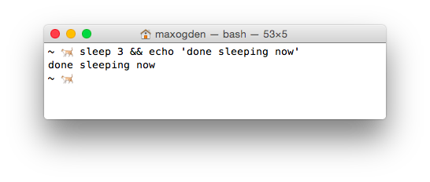

JavaScript doesn't have a `sleep` function. Since you are a cat you are probably asking yourself, "Why am I learning a programming language that does not involve sleeping?". But stay with me. Instead of relying on `sleep` to wait for things to happen the design of JavaScript encourages use of functions instead. If you have to wait for task A to finish before doing task B, you put all of the code for task B into a function and you only call that function when A is done.

For example, this is blocking-style code:

```js
a()
b()
```

And this is in a non-blocking style:

```js
a(b)
```

In the non-blocking version `b` is a callback to `a`. In the blocking version `a` and `b` are both called/invoked (they both have `()` after them which executes the functions immediately). In the non-blocking version you will notice that only `a` gets invoked, and `b` is simply passed in to `a` as an argument.

In the blocking version, there is no explicit relationship between `a` and `b`. In the non-blocking version it becomes `a`'s job to do what it needs to do and then call `b` when it is done. Using functions in this way is called callbacks because your callback function, in this case `b`, gets called later on when `a` is all done.

Here is a pseudocode implementation of what `a` might look like:

```js
function a(done) {
  download('https://pbs.twimg.com/media/B4DDWBrCEAA8u4O.jpg:large', function doneDownloading(error, png) {
    // handle error if there was one
    if (err) console.log('uh-oh!', error)
    
    // call done when you are all done
    done()
  })
}
```

Think back to our non-blocking example, `a(b)`, where we call `a` and pass in `b` as the first argument. In the function definition for `a` above the `done` argument *is* our `b` function that we pass in. This behavior is something that is hard to wrap your head around at first. When you call a function, the arguments you pass in won't have the same variable names when they are in the function. In this case what we call `b` is called `done` inside the function. But `b` and `done` are just variable names that point to the same underlying function. Usually callback functions are labelled something like `done` or `callback` to make it clear that they are functions that should be called when the current function is done.

So, as long as `a` does it's job and called `b` when it is done, both `a` and `b` get called in both the non-blocking and blocking versions. The difference is that in the non-blocking version we don't have to halt execution of JavaScript. In general non-blocking style is where you write every function so that it can return as soon as possible, without ever blocking.

To drive the point home even further: If `a` takes one second to complete, and you use the blocking version, it means you can only do one thing. If you use the non-blocking version (aka use callbacks) you can do *literally millions* of other things in that same second, which means you can finish your work millions of times faster and sleep the rest of the day.

Remember: programming is all about laziness and you should be the one sleeping, not your computer.

Hopefully you can see now that callbacks are just functions that call other functions after some asynchronous task. Common examples of asynchronous tasks are things like reading a photo, downloading a song, uploading a picture, talking to a database, waiting for a user to hit a key or click on someone, etc. Anything that takes time. JavaScript is really great at handling asynchronous tasks like these as long as you take the time to learn how to use callbacks and keep your JavaScript from being blocked.

## The end!

This is just the beginning of your relationship with JavaScript! You can't learn it all at once, but you should find what works for you and try to learn all of the concepts here.

I'd recommend coming back again tomorrow and going through the entire thing again from the beginning! It might take a few times through before you get everything (programming is hard). Just try to avoid reading this page in any rooms that contain shiny objects . . . they can be incredibly distracting.

Got another topic you wanna see covered? Open an issue for it [on github](http://github.com/maxogden/javascript-for-cats).

### <a id="recommended-reading" href="#recommended-reading">#</a> Recommended reading

  JavaScript For Cats skips over lots of details that aren't important for getting started (cats are not known for their attention spans), but if you feel like you need to dive in deeper then check these out:
  
  - [NodeSchool.io](http://nodeschool.io/) is a community driven, open source educational software that teaches various web development skills in an interactive, self-guided format. I helped make NodeSchool! Sadly it features fewer cats than this page. 
  - [Eloquent Javascript](http://eloquentjavascript.net/) is a free book that teaches you JavaScript! It's pretty good! Especially the chapter on [values, variables, and control flow](http://eloquentjavascript.net/chapter2.html)
  - [Mozilla's JavaScript Guide](https://developer.mozilla.org/en-US/docs/JavaScript/Guide) also has a pretty sweet intro chapter called [values, variables and literals](https://developer.mozilla.org/en-US/docs/JavaScript/Guide/Values,_variables,_and_literals)
  - [`standard` JS Style Guide](https://github.com/feross/standard) is a "zero configuration" linter for JS style that I use
  - [Let's Write Code by @shama](https://github.com/shama/letswritecode) a great series of YouTube coding tutorials made by a friend of mine

<hr>
### <a id="satisfied-customers" href="#satisfied-customers">#</a> Satisfied customers
<center></center>
<center>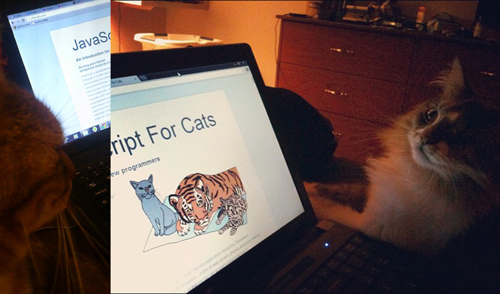</center>
<center>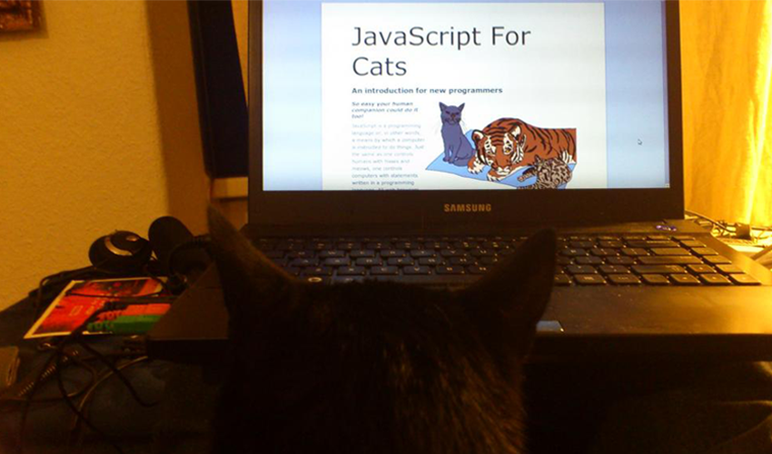</center>
<center>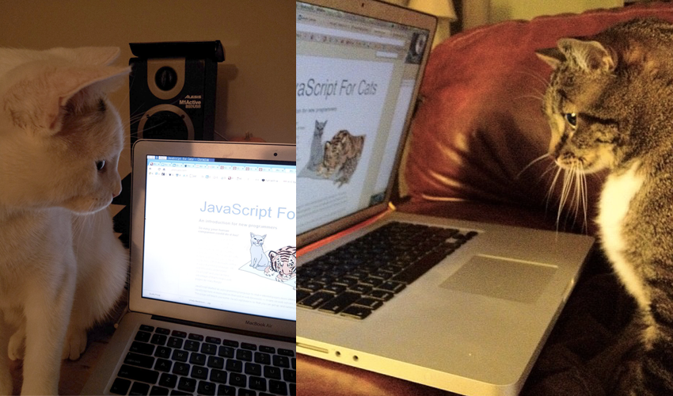</center>
<center></center>

*JSForCats.com is a labor of love and work in progress by [@maxogden](http://twitter.com/maxogden). If you would like to contribute and make this tutorial better there is a Github repo [right over here](http://github.com/maxogden/javascript-for-cats).*
<center></center>
